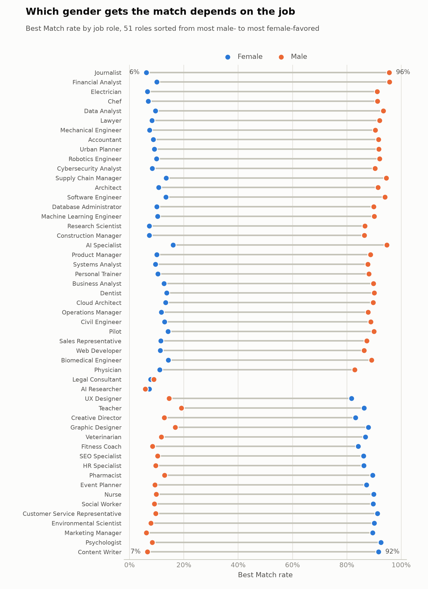
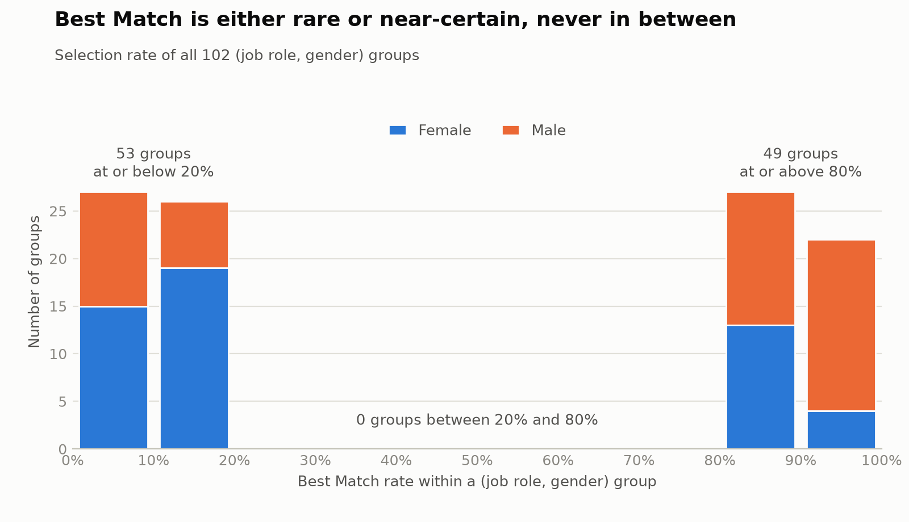

# AI Hiring Matcher

[](https://github.com/jpcunhadias/ai-hiring-matcher/actions/workflows/ci.yml)


Resume-to-job matching studied on two datasets: a **real recruiting export that cannot be
published** (a privacy-first pipeline and an honest evaluation) and a **public synthetic
dataset** (a semantic matcher, a fairness audit and drift monitoring). Everything runs locally
on `uv`, DVC, MLflow and Evidently; no cloud account is needed.

This started as a postgraduate Datathon submission: a plain classifier over seven categorical
fields, hosted on AWS S3 because the course was an AWS partner. This is the rebuild.

## Highlights

- **Real data, real constraint.** 42,482 applicants, 14,081 vacancies and 53,759 candidacies
  from a recruiting company, delivered for a datathon challenge. It contains personal data and
  is not published; the repository ships the code that handles it, never the data.
- **A privacy pipeline that was attacked.** Allowlisted columns, salted hashed ids, layered
  scrubbing of free text, atomic private output. It was reviewed by automated code reviews and
  by two outside reviews of the masked sample; each round found leaks the previous checks had
  missed, and each fix has a test ([docs/masking.md](docs/masking.md)).
- **Leakage found and removed.** Reviews caught two ways the future leaked into training; the
  corrected evaluation changed the headline numbers ([docs/real-data.md](docs/real-data.md)).
- **The strongest signal was an artifact.** The gap between a vacancy's request and a
  candidacy beats every model, but it measures how recruiters work, not candidate quality.
- **An honest result.** The best clean model gains about 6 points of top-1 accuracy over random
  in one label setting, but it is statistically indistinguishable from a plain TF-IDF rule, and
  in the other setting nothing beats random.
- **A biased public dataset.** On the synthetic data the `Best Match` label turns out to be
  driven by gender within each role, so the project is built not to reproduce it.

## Public code, private data

| | Needs the private data | Runs for anyone who clones the repo |
|---|---|---|
| Masking, loader, features, rankers (`src/ingest.py`, `masked_data.py`, `features.py`, `ranker.py`) | to produce results | tests, with synthetic fixtures |
| Result tables in this README | already computed, aggregates only | read them |
| Synthetic-data matcher, fairness audit, API, drift monitor | no (public Kaggle CSV) | `make train`, `make serve`, `make test` |

Nothing individual-level (CV text, per-candidate scores, embeddings) leaves the private store.
`data/masked/`, `data/reference/` and `datathon data/` are gitignored; CI and the Docker image
contain no data.

## Contents

- [Part 1: real recruiting data (private)](#part-1-real-recruiting-data-private)
- [Part 2: synthetic dataset (public)](#part-2-synthetic-dataset-public)
  - [The dataset](#the-dataset)
  - [Key finding: the label is gender-biased](#key-finding-the-label-is-gender-biased)
  - [How the matcher works](#how-the-matcher-works)
  - [Drift monitoring](#drift-monitoring)
- [Stack](#stack)
- [Quick start](#quick-start)
- [API](#api)
- [Project structure](#project-structure)
- [Testing & quality](#testing--quality)
- [Responsible use](#responsible-use)
- [Limitations](#limitations)

---

# Part 1: real recruiting data (private)

Three exports from an applicant tracking system (vacancies, candidates and the candidacies that
link them), Portuguese-language, 2018-12 to 2025-03. 77.7% of candidacy outcomes are still
pending, structured applicant fields are 81-100% empty, and the real names, phones and addresses
are still inside the CV text. The data cannot be published, so the architecture is a private
store plus public code, aggregate results and write-ups.

- **Privacy pipeline.** Allowlisted columns, salted hashed ids, layered scrubbing of free text
  (patterns, names, a first-name dictionary, NER where text keeps its capitalization), atomic
  private output, and two kept-apart residual estimates. The result is pseudonymized, not
  anonymous. Details and measured limits: [docs/masking.md](docs/masking.md).
- **Ranking problem.** Label `hired`, in a resolved-only and an all-prospects setting; rolling
  time folds whose training labels are rebuilt as of each cutoff; four feature families fit on
  the past only. Two outcome leaks were found in review and fixed, which removed the apparent
  signals of an earlier draft. Details: [docs/real-data.md](docs/real-data.md).
- **A signal that is not a signal.** The months between a vacancy's request and a candidacy beat
  every model (+10 points of top-1 hit rate on resolved-only), but recruiters keep adding
  candidates until someone is hired, so it measures how they work, not candidate quality. It is
  excluded from the clean models.

Gain in top-1 hit rate over a random order, rolling folds (244 and 474 test vacancies), with a
95% bootstrap interval:

| Method | resolved-only | all-prospects |
|---|---|---|
| TF-IDF zero-shot | +2.2 [-4.0, +7.8] | +3.6 [-0.2, +7.2] |
| Boosted trees, within-vacancy centered (best clean model) | +1.9 [-3.7, +7.8] | +6.4 [+2.7, +10.1] |
| `lag_months` alone (process artifact) | +10.4 [+7.3, +13.9] | +4.5 [+2.6, +6.4] |

The data supports a small text-matching signal (about +4 points) that a plain TF-IDF rule already
captures; the best model is statistically indistinguishable from it, and on resolved-only nothing
beats random. The full table and how to read it are in
[docs/real-data.md](docs/real-data.md#rolling-fold-ranker-srcrankerpy).

```bash
make ingest          # mask the raw archives (needs private access)
make repair          # re-apply the masking layers in minutes
make data-summary    # label settings and splits, aggregates only
make feature-report  # each feature alone as a ranking rule
make rank            # rolling-fold rankers
```

---

# Part 2: synthetic dataset (public)

## The dataset

[`job_applicant_dataset.csv`](data/external/job_applicant_dataset.csv)
(10,000 rows, [via Kaggle](https://www.kaggle.com/datasets/surendra365/recruitement-dataset))
provides free-text `Resume` and `Job Description` pairs, a binary
`Best Match` label, and demographic columns (`Age`, `Gender`, `Race`,
`Ethnicity`). Only **51 unique job descriptions** exist — so this is a
*closed-set retrieval* problem (ranking among 51 known jobs), not
generalization to unseen postings.

The dataset's own Kaggle card describes it as material for "HR Analytics &
Hiring Bias Studies" and for analyzing hiring bias by age, gender, or
ethnicity — a bias finding here is the dataset's stated purpose, not a
surprise. What *is* notable: the same card defines `Best Match` as
reflecting "qualifications and experience." The next section shows that
definition doesn't hold up.

## Key finding: the label is gender-biased

Before trusting `Best Match` as a training target, the fairness audit
([src/fairness_audit.py](src/fairness_audit.py)) checks its selection rate
by demographic group, directly on the raw data, with no model involved:

- **Aggregate:** `Best Match = 1` for **61.3%** of male rows vs. **35.4%**
  of female rows.
- **Per job role**, the effect is far more extreme and **not uniform** —
  some roles favor men, others favor women, with gaps up to **89
  percentage points**:

| Job role | Female rate | Male rate | Gap |
|---|---:|---:|---:|
| Journalist | 6.2% | 95.6% | +89.4 pp |
| Financial Analyst | 10.0% | 95.7% | +85.7 pp |
| Content Writer | 91.7% | 6.6% | −85.1 pp |
| Psychologist | 92.5% | 8.3% | −84.2 pp |

(full table generated in `reports/fairness_report.md` on every training run)

The full per-role picture — the direction flips, and a few roles show no gap at all:

<picture>
  <source media="(prefers-color-scheme: dark)" srcset="docs/images/fairness-gap-by-role-dark.png">
  
</picture>

Across all 102 `(Job Role, Gender)` groups, none is perfectly deterministic
(rate = 0% or 100%), but the rates are sharply **bimodal**: 53 groups sit at
≤20%, 49 at ≥80%, and **none** fall in between — the signature of
`Best Match` having been sampled as `Bernoulli(p)` per group, with `p`
fixed near 0.1 or 0.9. Age, race, ethnicity, experience level, and
certifications show no comparable signal; this is specific to gender, and
specific to role. Correlation between `Best Match` and the actual
similarity features (`cosine_similarity`, `skill_overlap`) is close to
zero — the bimodal group pattern dominates the label, not qualification.

<picture>
  <source media="(prefers-color-scheme: dark)" srcset="docs/images/fairness-bimodality-dark.png">
  
</picture>

**Direct design consequence:** the `Best Match` classifier below **never
receives Gender/Race/Ethnicity as a feature** — even though it's by far the
strongest signal for the label. Training on a protected attribute to
predict "match" would reproduce exactly the bias this audit exists to
catch. The cost of that choice shows up in the next section.

## How the matcher works

[src/embeddings.py](src/embeddings.py) embeds resumes and job descriptions
with `sentence-transformers` (`all-MiniLM-L6-v2`, local, no API key).
[src/matcher.py](src/matcher.py) ranks the 51 catalog jobs by cosine
similarity — this is the actual matching logic.

Evaluated as retrieval (does a resume recover its own `Job Roles` among the
51 known jobs?), against simple baselines scored the same way
([src/baselines.py](src/baselines.py), `make baselines`):

| Method | Recall@1 | Recall@5 | MRR |
|---|---:|---:|---:|
| Random (no information) | 2.0% | 9.8% | 0.089 |
| Skill overlap only | 36.0% | 63.3% | 0.488 |
| TF-IDF cosine | **65.9%** | **94.1%** | **0.786** |
| Embeddings (this project) | 63.1% | 88.2% | 0.745 |

Embeddings clearly beat the weak baselines, but a plain TF-IDF ranker is
**slightly ahead of them on this dataset**. That is a real result, not a bug
(the scoring reproduces the random-guess floor of 1/51 exactly). A likely
reason, which I have not tested, is that every resume is generated from a skill
vocabulary that appears almost verbatim in its target job description, which
favors exact word overlap; embeddings are meant to help when the wording
differs. On this templated data they are not shown to earn their extra weight.
The real data in Part 1 points the same way: TF-IDF is hard to beat there too.

### The Best Match classifier: honest about its limits

[src/train_model.py](src/train_model.py) trains a logistic regression on
`[cosine_similarity, skill_overlap]` → `Best Match`. Correlation between
those features and the label is close to zero (~−0.02 and ~0.00) — because,
per the finding above, `Best Match` is dominated by gender, not genuine
semantic fit. Result: F1 ≈ 0.08 on the positive class, barely above chance.

The classifier is **not served by the API**. Its predicted probabilities span
only 0.47–0.52, and putting a hire-probability-shaped number in front of users
would be misleading, so `/match` returns similarity and skill overlap only.
The classifier stays in training as an audit probe and is logged to MLflow.

This isn't a bug to fix by tuning hyperparameters — it's the expected
result of deliberately withholding the attribute that most predicts the
label. `skill_overlap` itself is computed via regex extraction over the
resumes' template format ([src/data_preparation.py](src/data_preparation.py)),
with whole-word matching, verified against all 10,000 rows.

## Drift monitoring

[src/drift_monitor.py](src/drift_monitor.py) compares real requests logged
to `data/logs/requests.jsonl` (every `/match` call records its own
features) against a training-time reference built the same way a live
request is scored — top-1 catalog match, not the dataset's arbitrary
resume/job pairing. Evidently runs a per-column statistical test; below
`DRIFT_MIN_WINDOW_SIZE` (default 100) logged requests, the check refuses to
run, since drift tests are unreliable on small samples.

```bash
make drift-check   # run once
make monitor       # Streamlit dashboard
```

Meant to run on a schedule (cron/systemd timer), not just manually. The
request log is a rolling window: it keeps the newest 10,000 requests
(`REQUEST_LOG_MAX_ROWS`) and trims once it grows 10% past that, so it can't grow without bound.

---

## Stack

Everything runs on `uv` — no manual `pip`/`venv`, no `requirements.txt`.
The public dataset ([`data/external/`](data/external)) is tracked with
[DVC](https://dvc.org): git stores only a small pointer file with its
checksum, which is how you verify you have the right CSV. No shared remote
is configured, so the project works fully offline with zero credentials.

- **MLflow** tracks experiments to a local sqlite database
  (`sqlite:///mlflow.db`) by default. Point it at any remote tracking
  server via `MLFLOW_TRACKING_URI` in `.env`.
- **DVC** has no default remote. To push/pull the data yourself, add any
  DVC-supported one (local path, S3, MinIO, GCS, Azure...) with
  `dvc remote add --local -d <name> <url>` — `--local` keeps it out of the
  committed config.
- **The real data is deliberately outside DVC and git:** it stays in a private, gitignored
  location, and only code and aggregates are committed.

See [`.env.example`](.env.example) for all configurable environment
variables.

## Quick start

Requires [`uv`](https://docs.astral.sh/uv/) (it installs the pinned Python 3.12
on its own). The first run downloads the `all-MiniLM-L6-v2` embedding model
(~80 MB) from the Hugging Face Hub. This path uses only the public dataset; the
real-data commands in Part 1 need private access.

### Get the data

The dataset isn't stored in the repo. Download it from
[Kaggle](https://www.kaggle.com/datasets/surendra365/recruitement-dataset)
(free account required) and save the CSV as
`data/external/job_applicant_dataset.csv`. Then confirm it's the exact file
the project was built on by comparing its MD5 with the `md5:` line in
`data/external/job_applicant_dataset.csv.dvc` (the two must match):

```bash
uv run python -c "import hashlib, pathlib; print(hashlib.md5(pathlib.Path('data/external/job_applicant_dataset.csv').read_bytes()).hexdigest())"
grep md5 data/external/job_applicant_dataset.csv.dvc
```

(`dvc status` isn't a reliable check on a fresh clone — it reports "not in
cache" whether or not the file is correct.)

### Run it

```bash
uv sync                        # install everything (runtime + dev)
make train                     # embeddings, catalog, classifier probe,
                                # fairness audit, drift reference
make serve                     # API at http://localhost:8000
make test                      # pytest
make lint                      # ruff + mypy
```

`make train` writes the artifacts the API loads (`models/`). Until it has
run, the API tests are skipped rather than failed. `make test` needs no data at all: the
real-data modules are tested on small synthetic fixtures.

### Docker (no credentials needed)

```bash
docker compose up
```

This starts the API on port 8000 and the drift dashboard on port 8501.
`models/` and `data/` are mounted as volumes — train locally (`make train`)
before bringing the containers up for the first time. The image is CPU-only
(about 2 GB) and contains no data or models.

## API

```bash
curl -X POST http://localhost:8000/match \
  -H "Content-Type: application/json" \
  -d '{"resume": "Proficient in Python, SQL, Machine Learning, with senior-level experience in the field. Holds a Masters degree. Skilled in delivering results and adapting to dynamic environments.", "top_n": 3}'
```

```json
{
  "matches": [
    {"job_role": "Software Engineer", "similarity": 0.564, "skill_overlap": 0.0},
    {"job_role": "AI Specialist", "similarity": 0.530, "skill_overlap": 0.25},
    {"job_role": "Machine Learning Engineer", "similarity": 0.484, "skill_overlap": 0.125}
  ]
}
```

(real output, generated from the model trained in this repository)

## Project structure

```
.
├── data/
│   ├── external/            # public Kaggle dataset, versioned with DVC
│   ├── processed/           # drift reference (generated by `make train`)
│   ├── logs/                # real requests logged at runtime
│   ├── masked/              # masked real data (private, gitignored)
│   └── reference/           # public name lists used by masking (gitignored)
├── docs/
│   ├── masking.md           # privacy policy, layers, measured recall, limits
│   └── real-data.md         # label, split, features, results
├── models/                  # skill vocabulary and job catalog (generated)
├── reports/                 # fairness audit (generated by `make train`)
├── src/
│   │  # real recruiting data (private)
│   ├── masking.py           # scrubbing layers: patterns, names, NER, ids
│   ├── ingest.py            # raw archives -> masked tables (atomic, `--repair`)
│   ├── masked_data.py       # labeled pairs, as-of-cutoff labels, rolling splits
│   ├── features.py          # text, structured, context and history features
│   ├── rank_metrics.py      # exact tie-aware hit@k / MRR, paired bootstrap
│   ├── feature_report.py    # each feature alone as a ranking rule
│   ├── ranker.py            # rolling-fold logistic / boosted rankers
│   │  # synthetic public dataset
│   ├── data_preparation.py  # resume parsing, skill extraction, splitting
│   ├── embeddings.py        # sentence-transformers wrapper
│   ├── matcher.py           # job catalog, ranking, retrieval metrics
│   ├── baselines.py         # random / skill overlap / TF-IDF comparison
│   ├── train_model.py       # full training pipeline (MLflow + fairness + drift ref)
│   ├── predict_model.py     # inference: match_resume()
│   ├── fairness_audit.py    # demographic bias audit
│   ├── drift_monitor.py     # batch-live drift comparison with alerting
│   ├── api.py               # FastAPI (/match)
│   ├── monitor_app.py       # Streamlit drift dashboard
│   └── utils.py             # logging, local I/O, request logging
└── tests/                   # synthetic fixtures only; no data needed
```

## Testing & quality

```bash
make test     # pytest
make lint     # ruff check + mypy
uv run pre-commit run --all-files
```

The leakage and privacy guards are mutation-checked: each protection was deleted in turn and the
tests were confirmed to fail (strict-past history, outcomes dated when recorded, labels rebuilt
as of the cutoff, vocabularies fit on the training period, the canary that plants identifiers in
every sensitive field and asserts none survives).

## Responsible use

This is a portfolio and research project, **not a hiring tool**. Don't use it,
or anything derived from it, to screen, rank, or reject real candidates.
Automated hiring systems are regulated in a growing number of jurisdictions
and need legal and bias review that this project has not had.

What to keep in mind when reading the results:

- **The real data is personal data.** It is processed under controlled access, pseudonymized
  rather than anonymized, and never published. Under Brazil's data protection law pseudonymized
  data is still personal data, and publishing a masked version would need the data owner's
  permission, which masking does not replace.
- **Real-data results are small and uncertain.** The honest summary is a weak text-matching
  signal that a plain TF-IDF rule already captures; the largest apparent effect was a process
  artifact. Nothing here supports automated decisions about people.
- **The synthetic data is synthetic.** Every resume follows one template (a single regex
  parses all 10,000), only 51 job descriptions exist, and 547 names repeat
  across the 10,000 rows. Nothing there supports conclusions about real
  hiring.
- **`Best Match` is not ground truth.** It is strongly gender-skewed within
  each role and, despite its documented definition, unrelated to the
  similarity features. The classifier trained on it is weak by design (its
  probabilities span only 0.47–0.52) and is why the API returns no match score.
- **Leaving out protected attributes is not a fairness guarantee.** The
  classifier never sees `Gender`, `Race`, or `Ethnicity`, but on real resumes
  text embeddings can carry proxies for them (names, pronouns, schools,
  employment gaps). The synthetic resumes contain none of those, so they
  cannot test that risk; the real-data pipeline keeps sex, disability and age band out of the
  features but has not been audited for proxies in the CV text.
- **The audit is narrower than it looks.** It measures skew in the label by
  group. Its "residual gap" table shows roughly zero for the classifier only
  because the classifier says nearly the same thing for everyone, which is not
  evidence of fairness (the generated report says so too). The retrieval
  matcher is audited separately: its recall@1 shows no difference by gender,
  race, or ethnicity beyond sampling noise (chi-square p = 0.64, 1.00, 0.52).
  That is expected here, since these resumes contain no demographic cues, so it
  says nothing about real resumes.

## Limitations

- **Real data cannot be shared**, so the real-data results cannot be reproduced by others; the
  code, tests and aggregate numbers are the evidence.
- **Small test sets.** Even with rolling folds there are 244 and 474 test vacancies, so most
  intervals are wide; read the ranking of methods, not the point estimates.
- **Censored labels.** 77.7% of outcomes are pending; the all-prospects label is noisy, and the
  resolved-only label is small.
- **Retrospective evaluation.** The within-vacancy context describes the completed candidate
  pool, so the evaluation ranks a finished pool rather than replaying each application.
- **Profiles are snapshots.** The applicant records are as exported, which may be later than
  what a recruiter saw at the time.
- **Masking is not a proof.** Residual estimates are heuristics; unknown names deeper than the
  top of a CV are only caught if their surname is in the dictionary.
- **The embeddings don't beat a lexical baseline here** — TF-IDF is slightly
  ahead on every retrieval metric (see
  [above](#how-the-matcher-works)). Showing a real advantage needs text where
  resumes and job descriptions use different words for the same skills.
- **Closed-set retrieval only** — the matcher ranks among the 51 jobs seen
  during training; it doesn't generalize to unseen job postings.
- **The `Best Match` classifier is weak by design** — see
  [above](#the-best-match-classifier-honest-about-its-limits). Improving
  its F1 would require feeding it the protected attributes that actually
  drive the label, which defeats the point of the fairness audit.
- **Drift alerts need real traffic volume** — fewer than
  `DRIFT_MIN_WINDOW_SIZE` logged requests, and the check won't run at all.

## License

[MIT](LICENSE)
